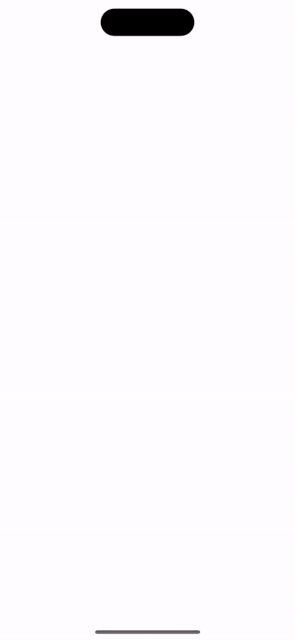

# MagicText

[](https://github.com/apple/swift-package-manager)

MagicText is the perfect solution when you need to show a small amount of information in a pretty wrapper.

## Gifs

     

## Installation

### [Swift Package Manager](https://swift.org/package-manager/)

Going to Xcode `File` > `Add Packages...` and add the repository by giving the URL  
`https://github.com/bullinnyc/MagicText`  
Enjoy!

## Usage

```swift
import MagicText
```

```swift
let singleLineExampleText = "Life is like a box of chocolates, you never know what you’re gonna get."

let multiLineExampleText = """
Life is like a box
of chocolates, you never
know what you’re
gonna get.
"""

// Charmed magic text (default).
MagicTextView(
    text: singleLineExampleText,
    fontSize: 28
) {
    print("Animation finished.")
}

// Fantasy magic text.
MagicTextView(
    text: multiLineExampleText,
    textColors: [.black.opacity(0.8)],
    fontSize: 28,
    magicType: .fantasy
) {
    print("Animation finished.")
}
```

### Set the type of MagicText
**Note:** Default `magicType` is set to `charmed`.  
You can try other types.

```swift
.charmed
.artLetter
.bubble
.fantasy
.charmedLetter(backgroundColor:)
```

## Requirements

- iOS 14.0 + / macOS 11.0 + / tvOS 14.0 + / watchOS 7.0 + / visionOS 1.0 +
- Xcode 15.0 +
- [SwiftUI](https://developer.apple.com/xcode/swiftui/)

## License

- MagicText is distributed under the MIT License.
